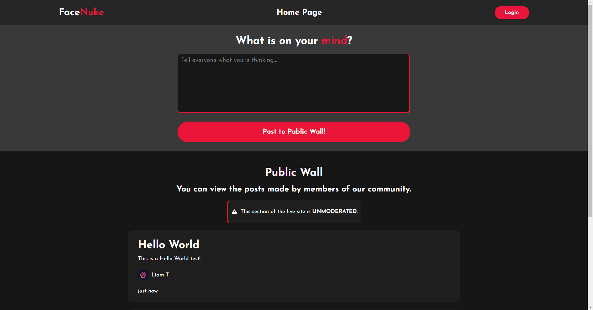

  <h1>FaceNuke</h1>
  
  <h2>A proof-of-concept social networking platform written in React! This project also uses Firebase!</h2>
  
  
  
  
  

# Introduction
This project was created in a couple of hours, and it's been a project I have been interested in trying before, I have recently just completed it and you can see the results in the work.

# Todo
. . .